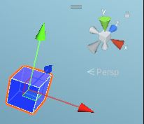
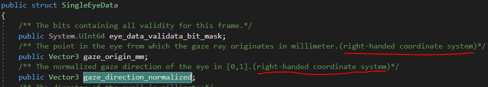

# vr-exoskeleton

Analysis and modeling from data collected for the VR Exoskeleton project.

## Install

To create a virtual environment and install dependencies from pip:

```commandline
python -m venv venv
source venv/bin/activate
pip install -r requirements.txt
python -m ipykernel install --user --name=vr-exoskeleton
```

On Windows, instead activate the environment (the second line above) by:

```commandline
venv\Scripts\activate
```

## Download Data

Navigate to the [dataset hosted on Figshare](https://figshare.com/articles/dataset/EyeTrackingVRDataset/25749378).

Click the **Download all** button.

Extract the content to the `data` directory:

```commandline
unzip ~/Downloads/25749378.zip data
```

### Caveat: Vector Handedness

The process for collecting the data for this project had one major issue:

Unity environments use a **left-handed** coordinate system while the eye tracker (Ranipal SDK) uses a *right-handed* coordinate system.





This means that the x-dimension of vectors recorded by one of either the game or the eye tracker needs to be negated.
Luckily, this has been done from the C# side of the code.
Code authors before me chose to negate the Unity environment x-axis of the normalized 3D direction of the player via the following:

```c-sharp
forward = Vector3.Scale(Camera.main.transform.forward, new Vector3(-1, 1, 1));
```

This code results in the Unity game vectors matching the handedness of the eye tracker's vectors.
When the user actually looked to the *right* in the game, e.g. `forward.x == 0.05`, we negate the recorded instance, as `forward.x == -0.05`.

This will work to train a model - when the user looks left, the head should move left.
But I ran into issues creating the visual vector fields and when additional data columns were collected such as eye origins.
This also caused me to add the parameter to train.py, `right_handed_coordinates` which is `False` by default.

## Train

Train a MLP model:

```commandline
python -m vr_exoskeleton.train mlp --run_name my_run --seed 1
```

Train a LSTM model:

```commandline
python -m vr_exoskeleton.train lstm --run_name my_other_run --seed 2
```

## Export

Export the trained model to the [ONNX](https://pytorch.org/docs/stable/onnx.html) format:

```commandline
python vr_exoskeleton/export.py
```

You can check that the model exported with proper dimensions and input/output layer names via [Netron](https://netron.app).

## Notebooks

From the repository root, open Jupyter Lab by:

```commandline
jupyter-lab
```
